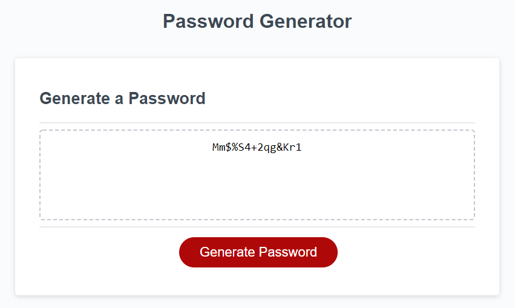

# Password Generator

This page generates a random password based on a series of user prompts. The user must select the password length (up to 128 characters) and whether to use several characters types. At least one character type must be selected, and a password is generated after all prompts are answered. The new password is then written on the page. This is accomplished using JavaScript to modify the document object model (DOM).

**Character Types**
- Uppercase
- Lowercase
- Numeric
- Special characters

[Password Generator](https://matthale11.github.io/password-generator/)

